Nama	: Arvian Eka Saputra

NIM	: 175410041

Kelas	: TI-9
________________________________________
**Pertemuan 1 - Instalasi Git**

1.	Download dan buka file Git.

2.	Ikuti langkah installasinya.
Disini memberikan informasi mengenai aplikasi Git.

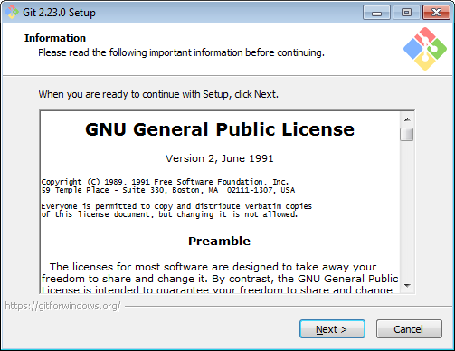
 

Akan dimintai untuk lokasi penyimpanan program Git yang diinstall.

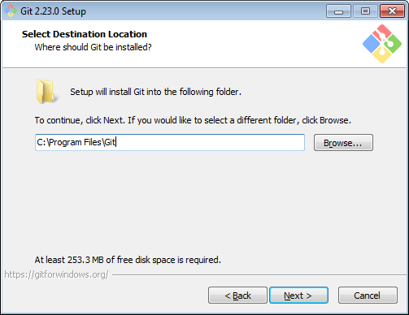

 
Pilih komponen apa saja yang akan diinstall (jika tidak mengetahuinya bisa default).

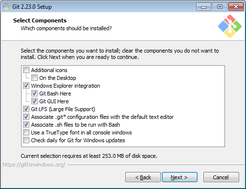

Pilih apakah akan membuat folder pada start menu atau tidak.

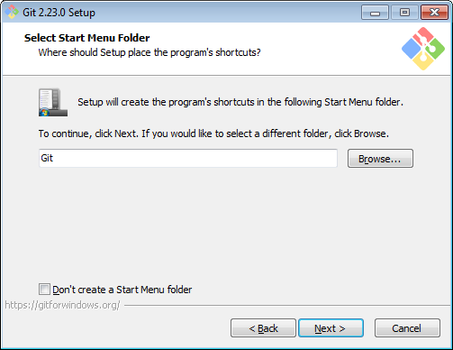

 
Pilih default editor yang digunakan pada Git.

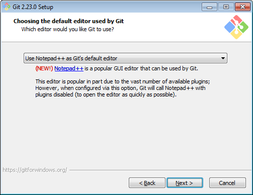

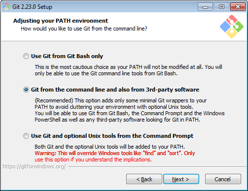

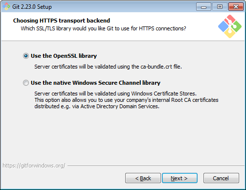

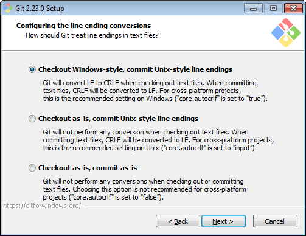

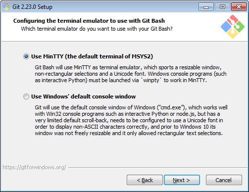

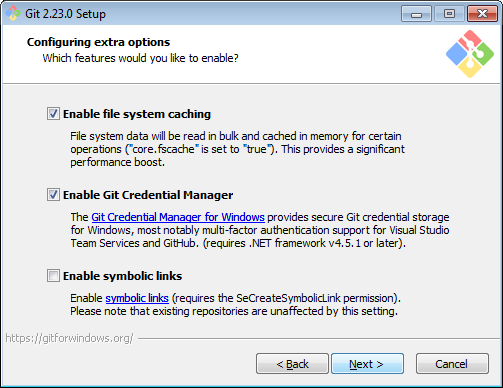

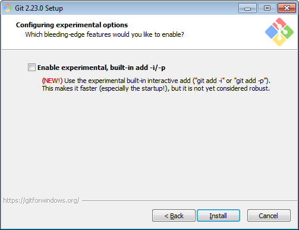

Tinggal tunggu proses instalasi.

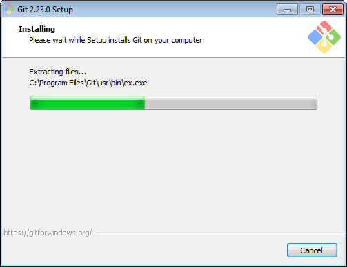

 
Jika sudah sampai pada bagian ini maka instalasi sudah selesai dilakukan.

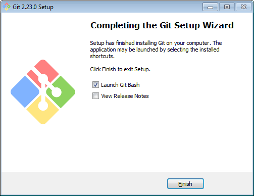