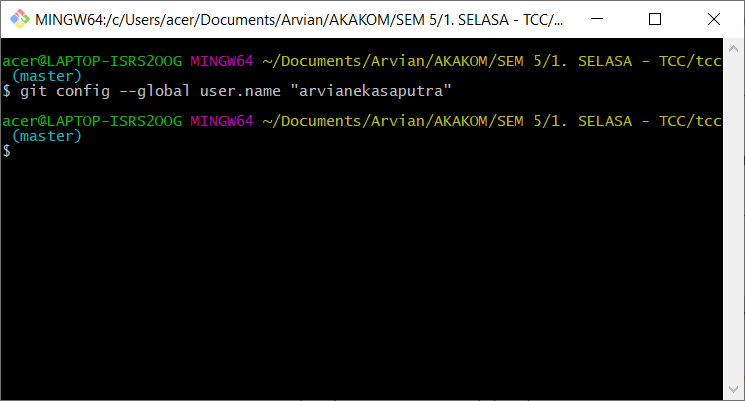
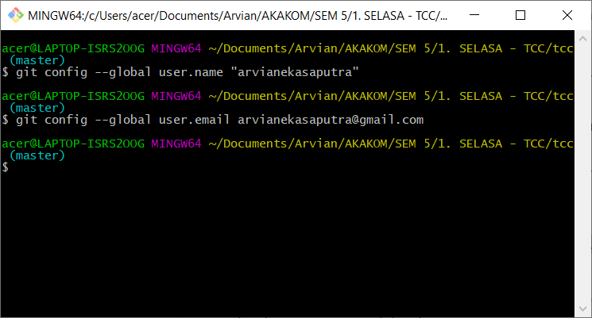
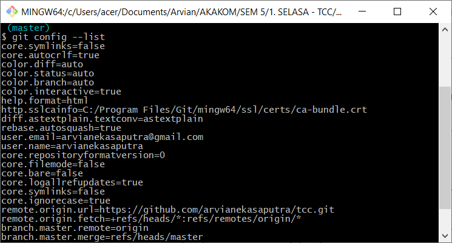
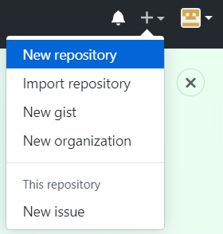
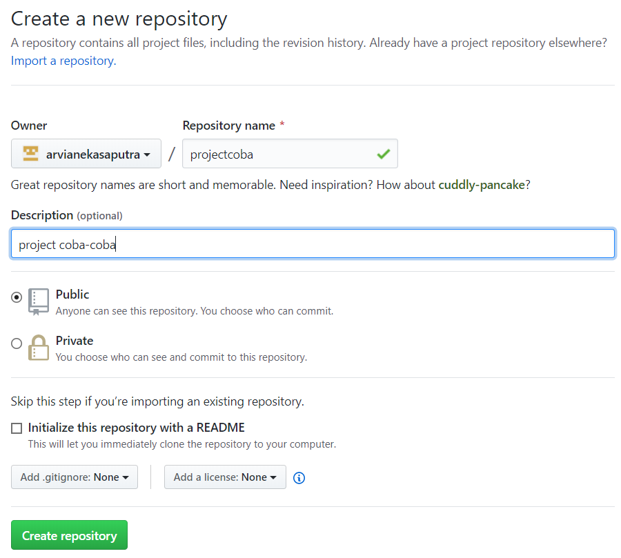
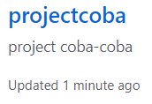
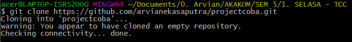

Nama	: Arvian Eka Saputra

NIM		: 175410041

Kelas	: TI-9
________________________________________
## Pertemuan 2

**Instalasi Git**

1.	Pastikan anda sudah membuka aplikasi Git Bash.

2.	Ketik git config --global user.name "Nama Anda di GitHub" dengan diisi username Git anda.

 

3.	Ketik git config --global user.email email@domain.tld dengan diisi email yang terdaftar pada Git anda.

 
4.	Untuk melihat config Git yang telah dilakukan pada nomor 2 dan 3 menggunakan command seperti ini git config --list.

**Mengelola Repo Sendiri di Account Sendiri**

1.  Klik tanda + pada bagian atas setelah login, pilih New repository

2.  Isikan nama, keterangan, serta lisensi. Jika dikehendaki, bisa membuat repo Private

3.  Klik Create Repository

**Clone Repo**

Untuk melakukan proses clone, gunakan perintah berikut: git clone https://github.com/arvianekasaputra/projectcoba.git

