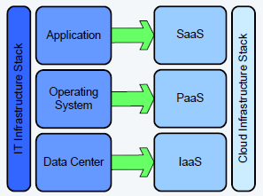

Nama	: Arvian Eka Saputra

NIM		: 175410041

Kelas	: TI-9
________________________________________
## Pertemuan 3

**Apa itu SaaS**

SaaS (software as a service atau perangkat lunak berbentuk layanan) adalah suatu model penyampaian aplikasi perangkat lunak oleh suatu vendor perangkat lunak yang mengembangkan aplikasi web yang diinangi dan dioperasikan (baik secara mandiri maupun melalui pihak ketiga) untuk digunakan oleh pelanggannya melalui Internet.

Pelanggan tidak mengeluarkan uang untuk memiliki perangkat lunak tersebut melainkan hanya untuk menggunakan. Pelanggan menggunakan perangkat lunak tersebut melalui antarmuka pemrograman aplikasi yang dapat diakses melalui web dan seringkali ditulis menggunakan layanan web atau REST.

Istilah ini belakangan mulai lebih dipilih kalangan industri terkait sebagai pengganti istilah penyedia layanan aplikasi dan on-demand (sesuai permintaan).

**Contoh SaaS**

Contoh SaaS sebagai berikut :

1. Cisco WebEx

2. Dropbox

3. Facebook

4. Google Drive, dll.

**Arsitektur SaaS**

Untuk arsitektur SaaS seperti dibawah ini.

