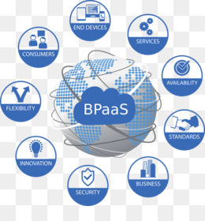

Nama	: Arvian Eka Saputra

NIM		: 175410041

Kelas	: TI-9
________________________________________
## Pertemuan 4

**Apa itu BPaaS**

Business Process as a Service (BPaaS) adalah jenis proses bisnis horizontal atau vertikal yang disampaikan berdasarkan model layanan awan. Layanan awan ini - yang mencakup Perangkat Lunak sebagai Layanan (SaaS), Platform sebagai Layanan (PaaS), dan Infrastruktur sebagai Layanan (IaaS) - oleh karena itu bergantung pada layanan terkait.

Karakteristik berikut menentukan BPAaS:

1. BPaaS duduk di atas tiga layanan awan pendiri lainnya: SaaS, PaaS, dan IaaS.

2. Layanan BPaaS dapat dikonfigurasi berdasarkan proses yang sedang dirancang.

3. Layanan BPaaS harus memiliki API yang terdefinisi dengan baik sehingga mudah dihubungkan ke layanan terkait.

4. BPaaS harus dapat mendukung banyak bahasa dan beberapa lingkungan penerapan karena bisnis tidak dapat memprediksi bagaimana proses bisnis akan dimanfaatkan di masa depan.

5. Lingkungan BPaaS harus bisa menangani skala besar. Layanan harus bisa pergi dari pengelolaan beberapa proses untuk beberapa pelanggan untuk dapat mendukung ratusan bahkan ribuan pelanggan dan proses. Layanan ini mencapai tujuan tersebut dengan mengoptimalkan layanan awan yang mendasari untuk mendukung jenis elastisitas dan penskalaan ini.

**Contoh BPaaS**

Contoh BPaaS sebagai berikut :

1. http://www.wipro.com/
menyediakan Layanan Bpaas :
- Business process outsourcing (http://www.wipro.com/services/business-process-outsourcing-BPO-services/)
- Infrastructure Management services (http://www.wipro.com/services/infrastructure-management-services/)
- Analytics information And management ( http://www.wipro.com/services/analytics-information-management/)

2. http://www.cognizant.com/
menyediakan Layanan Bpaas :
- Research And analytics
  Menyediakan layanan yg terdiri dari  Financial Research, Business/Market Research,etc 
- Finance and accounting
  Menyediakan layanan yg terdiri dari Customized Services, etc
- Vertical Markets 
   Menyediakan layanan yg terdiri dari Banking and Financial Services , Insurance, Life Sciences, etc

3. http://gartnerevent.com/
menyediakan Layanan Bpaas : 
-  Gartner Consulting (http://www.gartner.com/technology/consulting/)
-  Research Products and Services (http://www.gartner.com/technology/research.jsp
-  Vendor Briefings (http://www.gartner.com/technology/about/vendor_briefings.jsp)

**Arsitektur BPaaS**

Untuk arsitektur BPaaS seperti dibawah ini.

