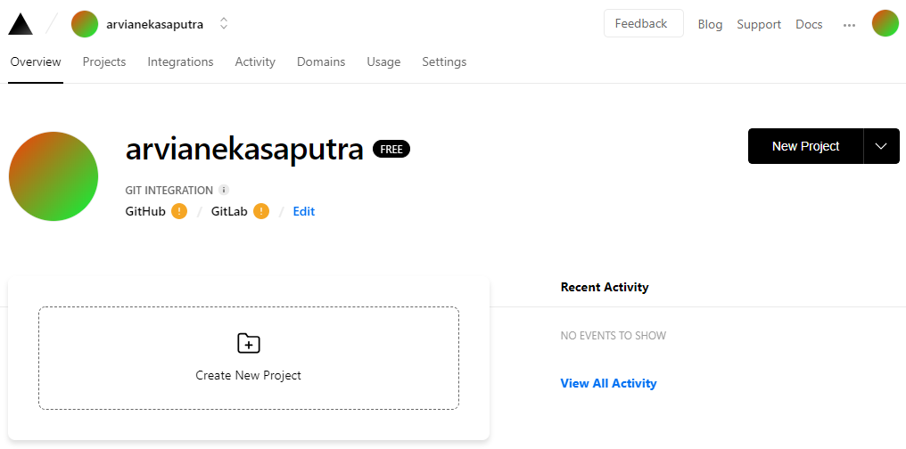
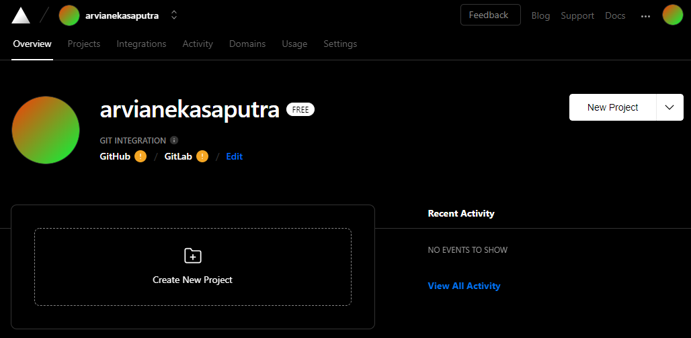
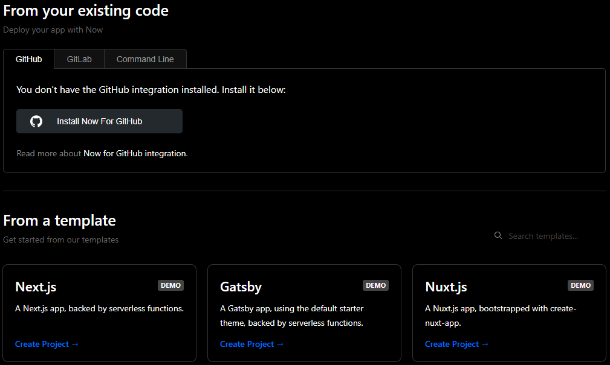
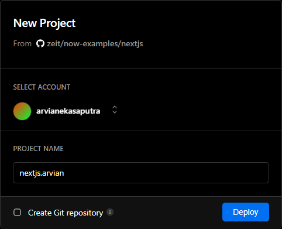
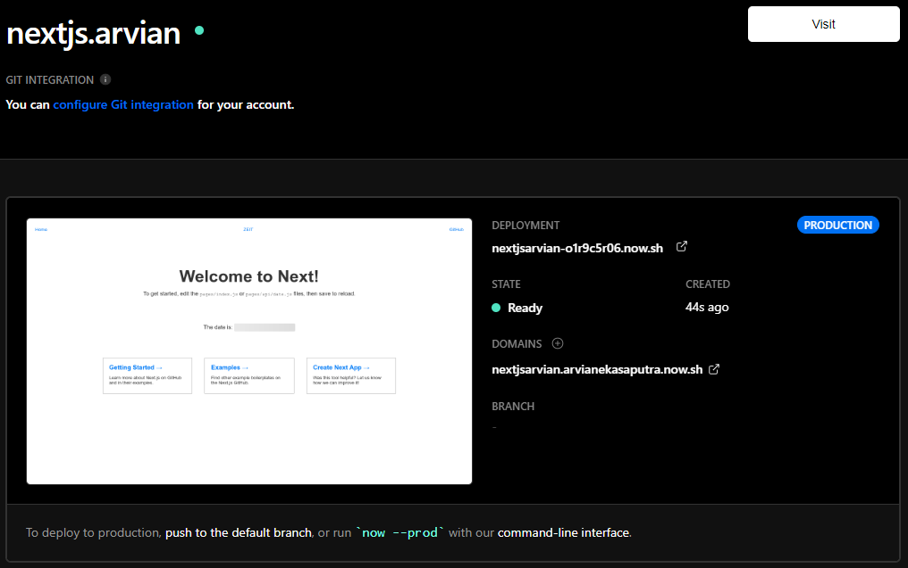

Nama	: Arvian Eka Saputra

NIM		: 175410041

Kelas	: TI-9
________________________________________
## Pertemuan 5

### ZEIT

1. Akses https://zeit.co

2. Login menggunakan akun github.

    

3. Akses ke  https://zeit.co/dashboard dan pilih create new project untuk membuat project.

    

4. Pada praktik ini kita memilih Next.js dan pilih bagian Create Project dan diberikan nama project yang kita inginkan dan pilih Deploy.

    

    

5. Disini berarti kita sudah berhasil membuat project baru.

    

Pythonanywhere.com

Gigalixir