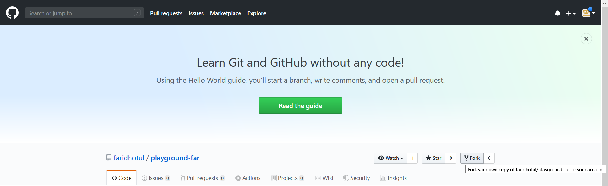
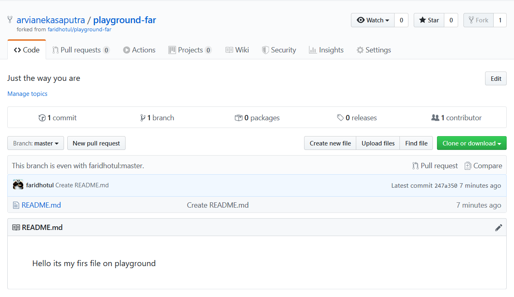
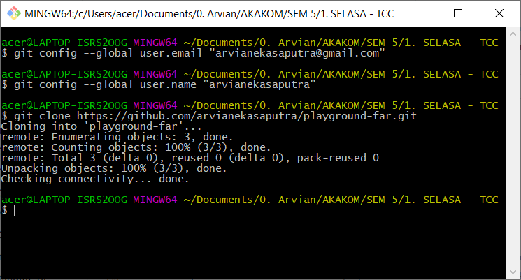
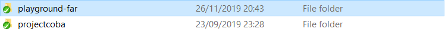
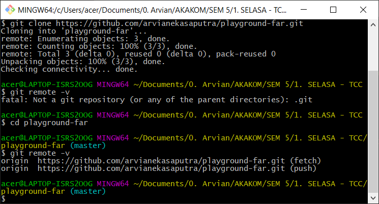
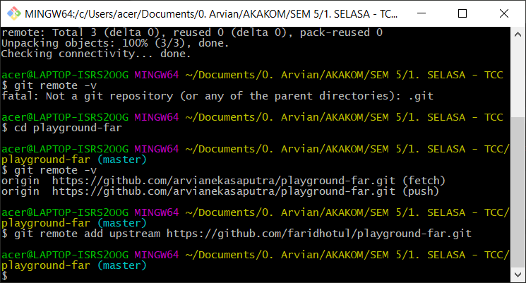
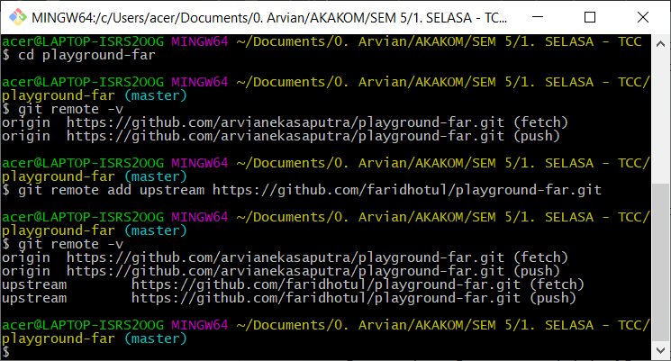

Nama	: Arvian Eka Saputra

NIM		: 175410041

Kelas	: TI-9

_______________________________________________________

## Pertemuan 10

##Git untuk Kolaborasi

Sumber : https://github.com/stmik-akakom/rtfm/blob/master/04-kolaborasi.md

###Fork

Fork adalah membuat clone dari suatu repo di GitHub milik upstream author, diletakkan ke milik kontributor.

Langkah :

1. Login ke GitHub

2. Akses repo yang akan di-fork: https://github.com/faridhotul/playground-far

3. Pada sisi kanan atas, klik Fork:

	

4. Setelah proses, repo dari upstream author sudah berada di account GitHub kita (kontributor)

	

5. Setelah proses tersebut, clone di komputer lokal:
	```	git clone https://github.com/arvianekasaputra/playground-far.git```

Dan akan didapati seperti ini ketika cek pada folder di local.





Repo origin sudah dituliskan konfigurasinya pada saat melakukan proses clone dari repo kontributor. Konfigurasi repo upstream harus dibuat.
	```git remote -v```



Tambahkan remote upstream :
	```git remote add upstream https://github.com/faridhotul/playground-far.git```



Lalu cek kembali dengan command dibawah ini :
	```git remote -v```

