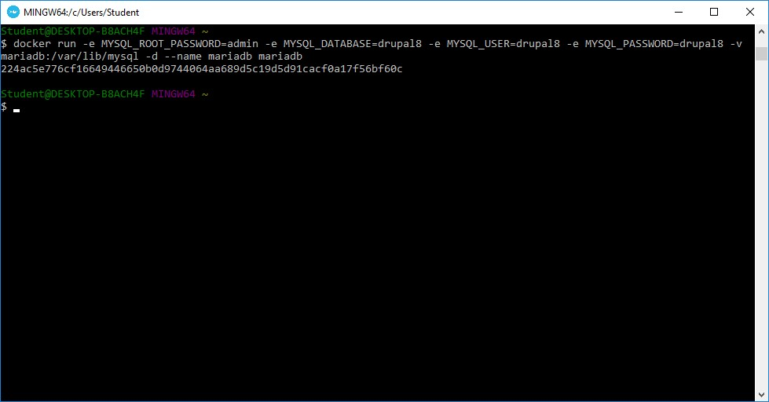

Nama	: Arvian Eka Saputra

NIM		: 175410041

Kelas	: TI-9

________________________________________

## Pertemuan 12

## Docker Drupal

Sumber : https://duvien.com/blog/using-docker-setup-test-environment-drupal-8-less-2-minutes

Set up database MySQL

 

Install docker compose
 

 

Upgrade pip version

Download image MariaDB
 

Pull drupal:latest
 

Melihat Images kita
 

Menjalankan sebuah container dengan MariaDB

Menjalankan Drupal container dengan sebuah hubungan untuk membuat MariaDB

Melihat container yang sudah ada.

