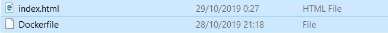

Nama	: Arvian Eka Saputra

NIM		: 175410041

Kelas	: TI-9
________________________________________
## TUGAS UTS - DOCKER

1. Untuk menggunakan Docker pastikan anda menginstall software Docker terlebih dahulu untuk OS Windows.

2. Pastikan juga anda sudah registrasi account Docker.

3. Jalankan software Docker yang sudah diinstall pada komputer.

4. Buka console / command prompt / powershell.

5. Lalu ketikkan command seperti dibawah ini untuk membuat direktori untuk menyimpan project Docker kita ini.

    ```
    PS C:\Users\User> mkdir arviansapu
    Directory: C:\Users\User


    Mode                LastWriteTime         Length Name
    ----                -------------         ------ ----
    d-----       10/29/2019  12:22 AM                arviansapu
    ```

6. Kemudian masuk ke direktori yang tadi sudah kita buat menggunakan command dibawah ini.

    ```
    PS C:\Users\User> cd arviansapu
    ```

7. Copykan terlebih dahulu untuk file Docker dan index.html kedalam direktori yang sudah dibuatkan.

    

7. Jalankan Docker dengan contoh command dibawah ini.
    ```
    PS C:\Users\User\arviansapu> docker build -t arviansapu/arviansapu:v3 . 

    Step 1/2 : FROM nginx:alpine
    ---> b6753551581f
    Step 2/2 : COPY . /usr/share/nginx/html
    ---> Using cache
    ---> 57221ec61f04
    Successfully built 57221ec61f04
    Successfully tagged arviansapu/arviansapu:v3
    SECURITY WARNING: You are building a Docker image from Windows against a non-Windows Docker host. All files and directories added to build context will have '-rwxr-xr-x' permissions. It is recommended to double check and reset permissions for sensitive files and directories.
    PS C:\Users\User\arviansapu> docker run -d -p 8912:80 --name=eka arviansapu/arviansapu:v3                               f30419d8fd3a2cdaa8ff652bf6fd6a577d36934dcc5818f8d657f6f50efcace4
    PS C:\Users\User\arviansapu> docker images                                                                              REPOSITORY                TAG                 IMAGE ID            CREATED             SIZE
    arviansapu/arviansapu     v3                  57221ec61f04        25 minutes ago      21.4MB
    ```
